# (03) Series

Wk 4 Material; Topic 3; Due 28 March

## The Cauchy Criterion (3.5)

### The Cauchy Convergence Criterion

A sequence is convergent if and only if it is a Cauchy sequence

* **Cauchy Sequence** implies **Convergence**
  * Every Cauchy sequence of real numbers is bounded, hence by the Bolzano-Weierstrass theorem the sequence has a convergent subsequence, 			hence is itself convergent.

* **Convergence** imples **Cauchy Sequence**
  * If two terms can be made arbitrarily close then any term can be made arbitrarily close to another term in the set (which will be the limit point).

## Properly Divergent

A series $(x_n)$ is said to be properly divergent if $\lim_{n\rightarrow \infty}(x_n) = \pm \infty$ 

## Definition of a Series [3.7.1]

if $x_n$ is a sequence, then the **series** generated by the sequence is $S = (s_k)$:

* The terms of the sequence are $x_n) = (x_1, x_2, x_3, x_4, \dots s_n)$

​	The terms of the series are $(s_n) = (s_1, s_2, s_3, s_4, \dots s_n)$

​	The terms of the series are called the **partial sums** and are defined as such:

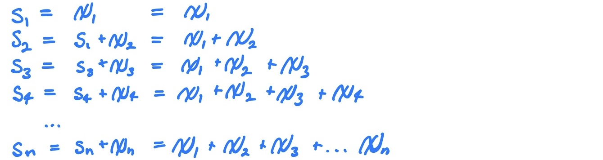

## Common Series Types

These are series that we are expected to memorise because
they so often appear in series problems (and moreover we we will need them for
the exam).

### Geometric Series (3.7.6 (a))
The Geometric Series is Convergent if and only if $\mid r \mid < $ :

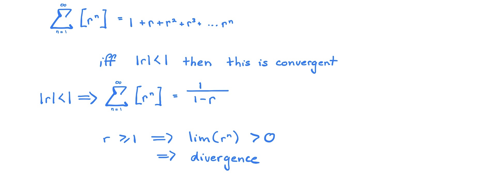

### Harmonic Series (3.7.6(b))
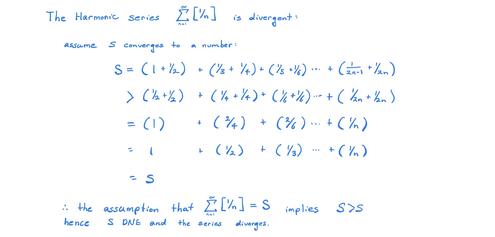

### $P$-Series

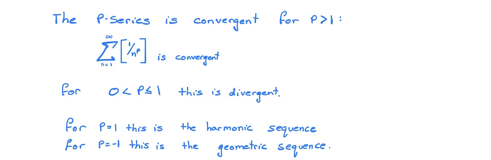

## Properties of Series

### The $n^\text{th}$ term test

This is more or less a test for divergence, it is necessary that a sequence $(x_n)$ has a limit of 0 in order for the series to be convergent:
$$
\exists L : \quad \sum_{n=1}^\infty \left[ x_n \right] = L \implies \lim(x_n)=0
$$
be careful however because a sequence with a limit of 0 is not sufficient to establish the convergence of a series:
$$
\exists L : \quad \sum_{n=1}^\infty \left[ x_n \right] = L \nRightarrow \lim(x_n)=0
$$

### Cauchy Criterion for series

If a sequence is convergent it must be a Cauchy sequence, hence all convergent series are composed of *Cauchy Sequences* (as a necessary but not sufficient condition).

So to be clear a series converges if and only if it is a *Cauchy Sequence*.

### Definitions

* A Cauchy Sequence is:
  * $\forall \varepsilon > 0, \exists M : \enspace m,n \geq M \implies \mid s_m -s_n \mid = \left| x_{n+1} + x_{n+2} + x_{n+3} \dots x_m \right| < \varepsilon$
* A Series Converges (which is an equivalent statement) if:
  * $\forall \varepsilon > 0, \exists M : \enspace ,n \geq N \implies \mid s_n -s \mid = \left| x_{1} + x_{2} + x_{3} \dots x_n \right| < \varepsilon$

## Convergence Tests

### Types of Convergence

A series $\sum [x_n]​$ is ***absolutely convergent*** if and only if $\sum \left[  \enspace \left| x_n \right| \enspace \right]​$ , otherwise the series is said to be conditionally convergent.

This is important because $\textsf{the convergence of } \sum \left[  \enspace \left| x_n \right| \enspace \right] \implies \textsf{the convergence of} \sum [x_n]$ 

Below the tests have been split into three categories:

* Comparison Tests
  * These establish non-absolute convergence but are broadly applicable and so are introduced early
* Absolute Convergence Tests
  * These establish absolute convergence.
* Non-Absolute Convergence Tests
  * These are useful for *alternating Series* and series that change sign as they progress (e.g. $\frac{sin(n)}{n}​$)

### Choosing a Test

Choosing the right test can be difficult, hence I have included an appendix with a [flow chart](http://tutorial.math.lamar.edu/Classes/CalcII/SeriesStrategy.aspx) [^1] that we should probably memorise for want of the exam 

[^1]: Strategy for Series, http://tutorial.math.lamar.edu/Classes/CalcII/SeriesStrategy.aspx

### Manipulating Series

Sometimes you'll be given a series in an odd way for example:
$$
S_n = \sum^\infty_{n=1} \left[ \frac{1}{(3n-2)\cdot (3n+1)} \right] 
$$
Now this could be shown to be convergent using the limit comparison test (which is below) but if you are asked to find the value to which the series converges to there is a bit more work involved.

Generally if you are asked to find what value a series converges to it will be either:

- A Geometric Series (3.7.6(a) of TB), or
- A telescoping Series

Geometric Series have already been shown, but a telescoping series is new and not covered in the textbook, basically, it is a series where most of the terms cancel out by way of rearrangement and grouping to leave only one or two terms left.

Often it is necessary to manipulate the terms somewhat in order for them to exhibit the cancelling/telescoping property, often by way of partial fractions (remember from *Mathematics1B*), for an example of this refer to Q3(c) of the corresponding tutorial $\tiny \textsf{(tutorial \#4 of wk 4 material, due wk. 5, topic 3 from learning guide)}$

#### Partial Fractions

In this case because the provided series is not a geometric series it must be a telescoping series (because otherwise we wouldn't be asked to find the value to which it converges to, we only know how to
find the convergence values of those two series, so we know it’s telescoping,
in order to get it into a form that will work, use partial fractions  [^2]

[^2]: Partial Fractions, [http://tutorial.math.lamar.edu/Classes/CalcII/PartialFractions.aspx](Pauls Calculus)

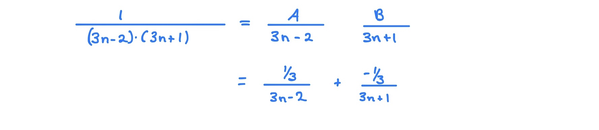

From here we would manipulate the series using grouping and rearrangement

#### Grouping Series

Grouping terms in a series does not affect the value to which it converges,

* This flows from the associativity of addition, a property exhibited by the $\mathbb{R}​$ which is the codomain of the sequence function

So in the above example the regrouping necessary to demonstrate the telescoping nature:

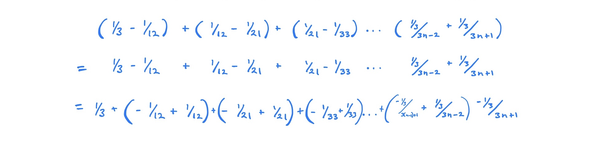

#### Rearrangements (9.1.5)
If a series is absolutely convergent then you can rearrange the terms and the series will converge to the same value (otherwise you can’t so be careful)

* So say you have some series and you rearrange it, if this new series is absolutely convergent thet it’s fine.

* However, if you rearrange some series and the new series is only conditionally convergent, then the rearrangement wasn’t logically valid and this convergence value is erroneous.   

So in our example the series is absolutely convergent so we could rearrange it:

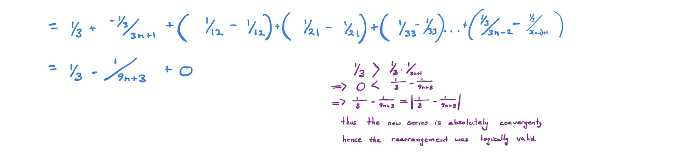

### Identities to remember

For the exam We need to remember these identities:

#### Limit of $e^\frac{1}{n}$
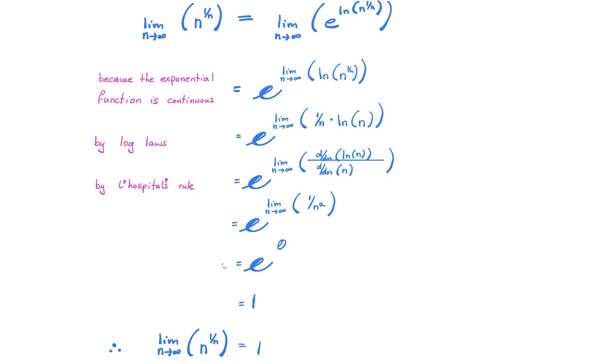

#### Dealing with Inequalities
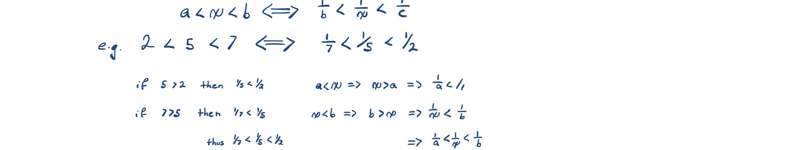

### Comparison Tests

#### Comparison Test (3.7.7)
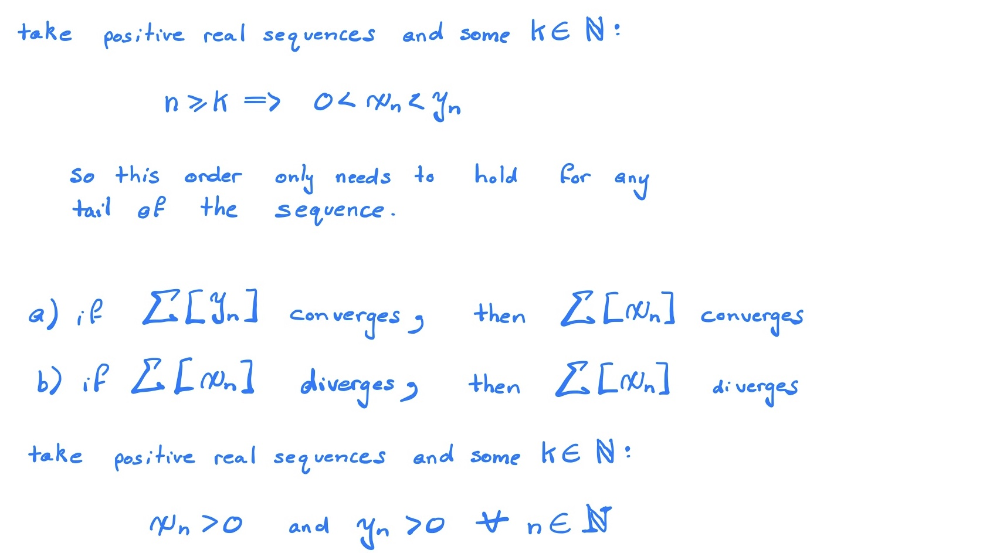
#### Limit Comparison Test (3.7.8)

Sometimes it can be difficult to establish the inequealities of the first test and a ratio would be easier to use, in that case this test can be used:
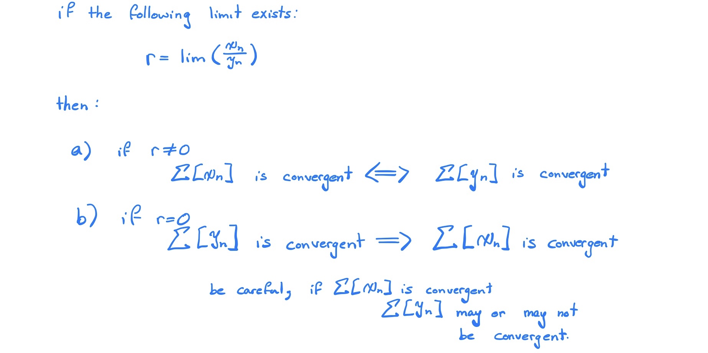

### Absolute Convergence Tests

If these tests are satisfied they will establish that the series is absolutely convergent.

#### Limit Comparison Test II (9.2.1) (For Absolute Convergence)

This version of the test is useful for establishing absolute convergence, it may be more difficult to establish however.

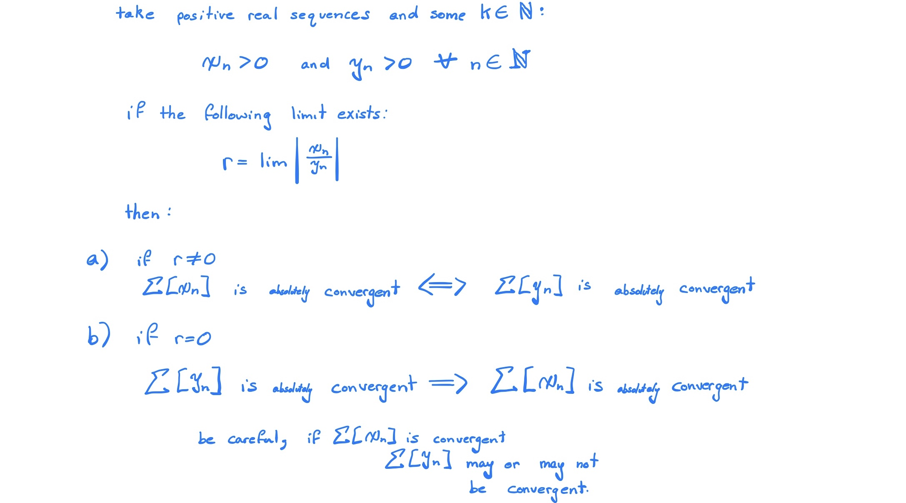

#### Ratio Test (9.2.4)
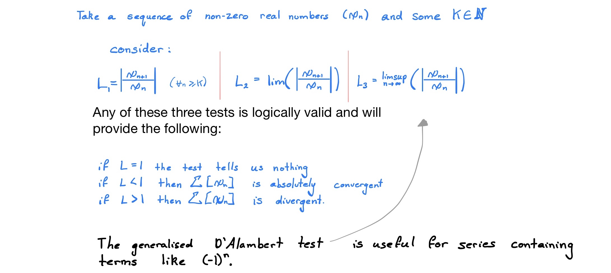

##### Generalised D'Alambert

This can be useful where the ratio test fails for want of $(-1)^{n+1}$ because the $\limsup()$ operator will strip that way for a $(+1)$.

It is worth remembering that a sequence $(x_n)$ is convergent if and only if:
$$
\liminf(x_n) = \limsup(x_n)=\lim(x_n)
$$
In this test however, we simply need to show that the $\limsup$ exists (which it will if the ratio-sequence has an upper bound), it isn’t necessary to show that the ratio-sequence is convergent.

* (However, it is necessary that the sequence which generates the series converges to 0, otherwise the series will be divergent)

#### Root Test
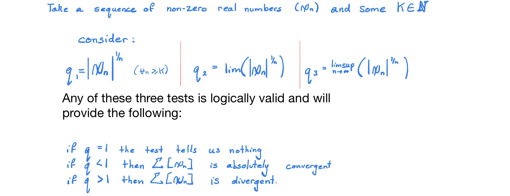

##### Generalised *Cauchy* Test

This can be useful where the root test fails for want of $(-1)^n$, the $\limsup()$ operator will strip that away for a $(+1)$.

#### Integral Test

If the series is of a function that is positive and ecreasint, then the series could converge if and only if the integral converges:

Let $f(k)$ be a positive decreasing function and let $k$ be some natural number:
$$
\exists L\in \mathbb{R} : \enspace L = \sum^\infty_{n=k} \left[ f(k) \right] \ \iff \int_\infty^k \! f(x) \, \mathrm{d}x = \lim_{b\rightarrow\infty}\left( \int_b^k \! f(x) \, \mathrm{d}x\right) 
$$

 Or basically the series will converge if and only if the corresponding integral converges,

* This flows from the notion that the area under a continuous curve is going to be greater than the various term values, hence by the comparison test it's going to converge.
* this is a test for absolute convergence because the terms of the sequence that generates the series are strictly positive as a prerequisite anyway.

### Non-Absolute Convergence Tests

#### Definition of an Alternating Sequence (9.3.1)

An alternating sequence is a sequence that changes sign at each iteration, so for example $(x_n) = \frac{(-1)^{n+1}}{n}$  is an alternating sequence because at each succession the sequence changes sign $(x_n) = \frac{\sin(n}{n}$ is not an alternating sequence because the terms doesn’t alternate at each succession:

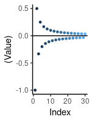 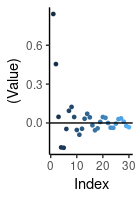

#### Alternating Series Test

Take a decreasing sequence of positive numbers $(Z_n)$, :

* If the sequence is such that:
  * $Z_{n+1} < Z_n \enspace  \enspace \wedge \enspace Z_n > 0 \qquad \forall n \in \mathbb{n}$ 

* Then the series will be convergent:
  * $\exists L \in \mathbb(R): \enspace \sum^\infty_{n=1} \left[ (-1)^{n+1} \cdot Z_n \right]$

So basically if the sequence is decreasing, then the series of the alternating sequence will hence converge.

#### Partial Summation Formula (Abel's Lemma)

Let $X: = \left( x_n \right)$ and $Y:= \left( y_n \right)$ by sequences in $\mathbb{R}$ and let the partial sums of $\sum\left( y_n \right)$ be denoted by $\left( s_)n \right)$ with $s_0 : = 0$
$$
  \sum_{k=n+1}^{m}\left[ x_ky_k \right]=\left( x_ms_m - x_{n+1}s_n \right) + \sum{k=n+1}^{m-1}\left( x_k-x_k+1 \right)s_k
  \label{partsum}
$$

#### Dirichlet's Test
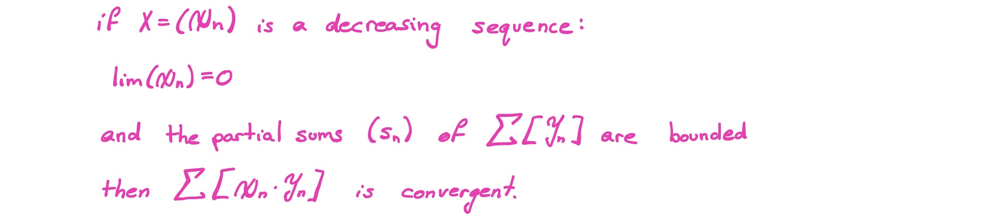

#### Abel's Test
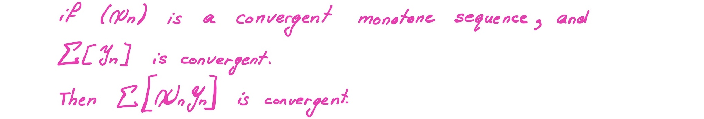

##### test
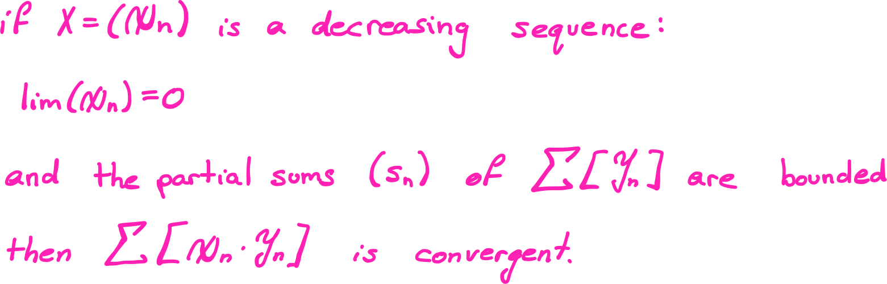 

