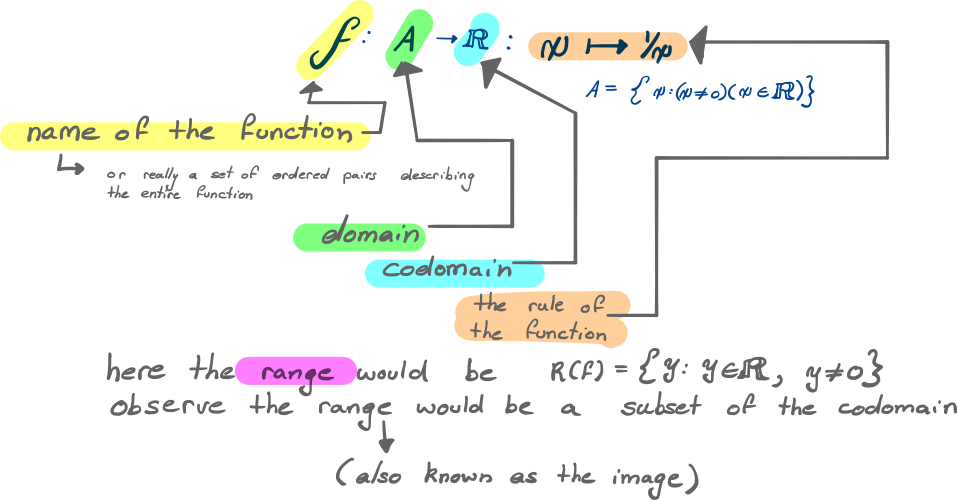
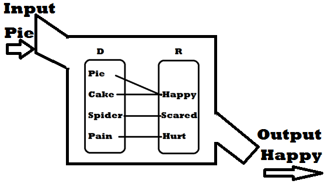
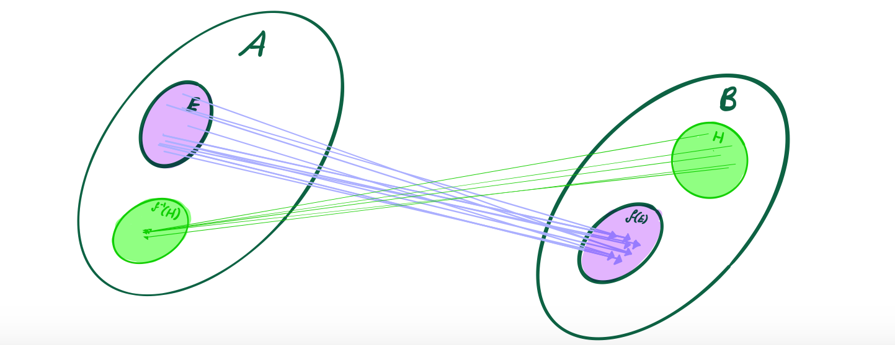

# Analysis Topic Summary
> *Analysis 200023   TB: [_Introduction to Real Analysis_ by Bartle and Sherbert](http://booksdl.org/get.php?md5=ef3626243a81006414e1f5a67ce694e0) 

**Author:** *Ryan G; 17805315*

[TOC]

---

# (1) Sets and Functions! 
> ***Week 1 Material, Due Thur. 7 March TB: [1.1], [1.2], [2.1], [2.2] ***

* [Sets](#an(1)sets)
* [Functions](#an(1)funcs)

## Sets

A set is a collection of elements, if an element is in that set it is written $x \in A$ and if not it is expressed $x \notin A$

A set can contain anything and is:
* **Unordered**  In that sets containing the same elements in a different order are considered equivalent 
* **Sans Repition**  In that a set contains only one copy of an element, like a file structure almost

*Example*
>$$\begin{align*}
>A &= \{1, 3, 8, 9\} = \{1, 3, 3, 8, 9\} =  \{8, 9, 9, 1, 3 \} \\
>&\neq \Big{\{}  {1, \{1, 3\}, 3, 8, 9} \Big{\}}
>&\end{align*}​$$

### Set Operations

#### Subset Notation

##### Subsets and Supersets

If $A$ is a set for which some or all elements are contained also within some other set $B$ it is written:
$$
A \subseteq B \notag
$$
This can also be expressed in terms of [supersets](http://mathworld.wolfram.com/Superset.html):[^supsetbrood] 

[^supsetbrood]: https://brainbrooder.com/lesson/2/subsets-and-supersets

$$
A \subseteq B \iff B \supseteq A
$$

##### Types of Subsets

Just like the symbols $>, \geq, \gneq$ there are equivalent symbols for subsets $\subset, \subseteq, \subsetneq$ :

| Name                                                | Notation         | Description                                    |
| --- | --- | ----- |
| **Proper Subset** | $A\subset B \iff B\supset A$ | $A$ Contains Some Elements of $B$ |
| **Subset or equal to ** | $A \subseteq B \iff B\supseteq A$ | $A$ Is a Subset or equal to $B$                |
| **Subset, but not equal**                           | $A \subsetneq B \iff B\supsetneq A$ | $A$ is a subset of, but not equal to, $B$      |

Hence observe the relationship of the number sets:

$$
\mathbb{Z^+} \subset \mathbb{N} \subset \mathbb{Z} \subset \mathbb{Q} \subset \mathbb{R} \subset \mathbb{C}
$$

Consider also, for later, the algebraic structure of these sets:

| Set                                   | Algebraic Structure                                          | Justification                                                |
| ------------------------------------- | ------------------------------------------------------------ | ------------------------------------------------------------ |
| $\mathbb{N}, \mathbb{Z^+}$            | Not a [ring](http://mathworld.wolfram.com/Ring.html)  Technically a [semiring](http://mathworld.wolfram.com/Semiring.html) | $\because$ The set is not closed under subtraction           |
| $\mathbb{Z}$                          | [Integral Domain](http://mathworld.wolfram.com/IntegralDomain.html) | $\because$ it is a ring that is commutative, with unity and no zero divisors |
| $\mathbb{Q} , \mathbb{R}, \mathbb{C}$ | [Fields](http://mathworld.wolfram.com/Field.html)            | $\because$ They are integral Domains in which every non-zero element is a unit |

An element in some ring is:

* A **unit** if there exists a multiplicative inverse for that element within that ring
* A **Zero Divisor** if there exists another element within that ring that will multiply to give zero, e.g.:

  > $\small 2\cdot 3 = 6 = 0 \in [\mathbb{Z}]_6​$

#### Operations

| Operation              | Definition                                                   | Description                                                  |
| ---------------------- | ------------------------------------------------------------ | ------------------------------------------------------------ |
| _Union_                | $A \cup B := \{ x: x\in A \vee x\in B  \}$                   | Take the elements of both Sets (i.e. a set containing anything that is in either A or B) |
| *Intersect*            | $A \cap B := \{ x: x\in A \wedge x\in B  \}$                 | Take the elements that both sets have in common (i.e. a set containing anything that is in both A and B) |
| *Compliment*           | $A \setminus B := \{ x: x\in A \wedge x\notin B  \}$         | So basically everything that's in $A$ but minus whats in $B$ (i.e. a set containing everything in $A$ that isn't also in $B$) |
| *Symmetric Difference* | $$\begin{align}A \Delta B = B \Delta A :=& (A\setminus B) \cup (B \setminus A) \\ =& (A\cup B) \setminus (A \cap B)\end{align}$$ | Take all the elements, take away what thay both have in common. |

##### De Morgans Law [1.14 of TB]

De Morgans Law is a good exemplar for the behaviour of operations in set theory:
$$
\text{a}) \qquad A\setminus (B \cup C) =  (A\setminus B) \cap (A \setminus C) \\
\text{b}) \qquad A\setminus (B \cap C) =  (A\setminus B) \cup (A \setminus C)
$$

## Functions

### Cartesian Product

The Cartesian Product combines elements of two sets:

$$
A \times B := \{(a,b) : a \in A, b \in B \}
$$

e.g.

> $$ \{ \square, \triangle \} \times \{ a, b, c \} = \{ (\square, a), (\square, b), (\square, c), (\triangle, a), (\triangle, b), (\triangle, c) \} ​$$
>
> $$\mathbb{R} \times \mathbb{R} = \mathbb{R}^2 = \{(a,b) : a \in \mathbb{R}, b \in \mathbb{R} \} $$
>
> >  So what that says is that it is every possible ordered pair of real numbers, or every point on a 2D cartesian plane

### Rigorous Definition of a function

A function $f​$ from a set $A​$ into some set $B​$ :

$$f: A \rightarrow B$$

is a 'rule of correspondence',

That maps from, every element in $A$, to some other element in $B$

> $(\forall x \in A) (!\exists x \in B)​$ 

So the issue with this definition is that it doesn't clearly establish what a rule of correspondence actually is, in order to do that we will leverage set theory.

#### Using Sets

Define a function $f$ as a set of ordered pairs.

> In Discrete Mathematics a set of ordered pairs is typically known as a graph

This might seem arbitrary, but the whole point is to define very unambiguously what a set is before we start trying to play with the mathematics of functions and calculus.

Some function $f$ from $A$ into $B$

> $f: A \rightarrow B$

is defined by a set $f \subsetneq (A\times B)​$:

 	1. $\forall a \in A, \exists b \in B: (a,b) \in f​$
      	1. So basically every input value $a \in A$ is assigned to some output
	2. $(a,b) \in f \enspace \wedge \enspace (a,q) \in f \implies b=q​$
        	1. So this says if an input can only have one output value
        	1. This is essentially the vertical line test

both of these can be combined into:\

$\forall a \in A, !\exists b \in B: (a,b) \in f​$

where the $!​$ character means that there is a unique value, so this would read:

> for any given value in $a \in A$ there is a single unique value in $b\in B$ such that the ordered pair $(a,b) \in f$

### Domain and Range

* Domain
  * The Domain is the set of allowable input values, 
  * The notation $D(f)$ is used to express the domain set
    * Generally a function is given and the domain restricted after the fact 
      * (e.g. $f(x) = \frac{1}{x}​$ has a domain $D(f) = \{ x : x \in \mathbb{R}, x \neq 0\}​$ 
* Codomain
  * The Codomain is the output set, it is a broad set that is either a superset or equal to the range set
    * e.g. the codomain of $f(x)$ above would be the reals
      * The codomain would represent the entire $y-\text{axis}$ whereas the Range would represent the set of all $y-\text{values}$ that the function crosses
* Range
  * The range (also known as the image of a set, is the set of all possible output values of a function, given the input,
  * The notation $R(f)$ is used to express the set of range values
    * (e.g. $f(x) = \frac{1}{x}$ has a Range $D(f) = \{ x : x \in \mathbb{R}, x \neq 0\}$ 
      

#### The Machine Analogy

One way to look at this is to consider a function like a machine, where the machine will only accept inputs from the domain and output something different. In this analogy everything that could possibly be output would represent the range value, the set of everything in the outside world might represent the codomain. 

### Direct and Inverse Image

Take some arbitrary function $f: A \rightarrow B: ​$, where:

> $$
> E \subseteq A \\
> $$
>
>$$
>H \subseteq R(f) \subseteq B
>$$

#### Direct Image

The direct image of $E​$ under $f​$ is essientially the range of the function that corresponds only to input values from $E​$.

> *In other words, the direct image of $E$ under $f$ is the range of the function if it was such that $E$ was the domain :*
>
> > $$
> > f(E) = \{f(x) : x \in E\}
> > $$
> >

#### Inverse Image

The inverse image of $H​$ under $f​$ is the set of input values corresponding to the output values of $H​$,

> *In other words, the inverse image of $H​$ under $f​$ is the domain of the function if it was such that $H​$ was the range:*
>
> > $$
> > f^{-1}(H) = \{ x \in A : f(x) \in H\}
> > $$

### Types of Functions

Injections, surjections and bijections are best illustrated by comparing them to the two necessary properties of functions:

#### Injections

An injection or injective function is also known as a one-to-one function, 

* a **function** must have only one output value corresponding to an input value:

$$
f(x) = f(a) \implies x = a
$$

​		In terms of the function as a set:
$$
(a,b) \in f  \enspace \wedge \enspace (a,q) \in f \implies b = q
$$

* Whereas an **injection** must *also* have only one input value corresponding to any given output value.

  $$
  f(x) = f(a) \iff x = a \label{injiff2}
  $$
  ​		In terms of the function as a set:
  $$
  (a,b) \in f \enspace \wedge \enspace (p, b) \in f \implies a=p
  $$

  

#### Surjections

  A surjection or surjective function is also known as an onto function,

  

* A **function** must have a corresponding output for all elements within the domain,

  $$
  \forall x \in A, \enspace \exists y \in B : f(x) = y
  $$
  ​		In terms of the function as a set:
  $$
  \forall a \in A, \enspace, \exists b \in B : (a,b) \in f
  $$

* A **surjection** must have a corresponding input for any given element within the codomain 

  $$
  \forall y \in B, \enspace \exists x \in A : f(x) = y
  $$
  ​		In terms of the function as a set:
  $$
  \forall b\in B, \enspace \exists a \in A : (a,b) \in f
  $$

  > If a function is a surjection, the codomain must also be equal to the range because the range cannot contain any extra elements
  > $$
  > B = R(f)
  > $$

#### Bijections

A bijection or bijective function is a function that is both injective and surjective, the whole point is that the inverse process of the function satisfies the requirements of a function, 
$$
  \forall x \in A, \enspace !\exists y \in B : f(x) = y
$$
  ​		In terms of the function as a set:
$$
\forall a \in A, \enspace, !\exists b \in B : (a,b) \in f
$$

The $!$ symbol means unique and hence encompasses also the definition of the injective function, the definition of the injective function provided by equation $(\ref{injiff2})$ is however useful for proving that some given function is an injection.

## Mathematical Induction

Refer to [1.2] of *TB*

### The Well-Ordering Principle

The *Well-Ordering Principle* is an axiom that states:

if a set contains

1. Only Natural Numbers, and
2. That set is non-empty

Then,

One of those elements within the set must be the smallest

#### The *WOP* and the integers

The *WOP* doesn't necessarily apply to other sets such as the integers, for example:
$$
\mathbb{Z} = \{  -\infty, \dots, -2, -1, 0, 1, 2, 3 \dots \infty \}
$$
Take any value $g\in \mathbb{Z}​$ , observe that:

$g \in \mathbb{Z} \implies (g-1) \in \mathbb{Z}$ 

This necessarily implies that the set of integers cannot have a least element.

### Mathematical Induction 
#### In Ordinary English

Mathematical induction is a principle of proofs that provides:

A statement or proposition $P(n)​$ is true if:

1. The first statement is true,
2. Given One Statement is true, then so is the next

If both of these conditions are satisfied, then mathematical induction provides that $P(n)$ is true for all positive whole values of $n$

#### In Mathematical Terms

Let $P(n)​$ be a statement abount some $n \in \mathbb{N}​$, this statement is true $\forall n\in \mathbb{N}​$ if the following conditions are satisfied:

1. $P(k)$ is true, and:
2. $(\forall n \geq k), \left(P\left(n\right) \implies P\left(n+1\right)\right)​$

Condition (1) is known typically as the *base* and (2) as the *bridge*. 

> This can be formally proved by contradiction (e.g. suppose $S \neq \mathbb{N}$ hence there must be some $a \in \mathbb{N}$ such that$a \notin S$, but there isn't thus $\mathbb{N} = S$). 

##### If/Then Statements

In order to prove the if/then statement of (2), first assume that $P(n)$ is true and then demonstrate that as a consequence of that $(P(n)+1)$ is true $(\forall n \geq k)$

> Also be aware that it is more that possible that (2) might be true for some or 	all values of $n$ even if (1) is false, there is no necessary connection between these two conditions or logical statements, the truth of one doesn't imply the truth of the other and only together do they establisht the overall truth of $S(n)$.

#### Establishing a Rigorous foundation for Induction

##### Induction for $S \subseteq \mathbb{N}$  TB: [1.2.2] 

Let $S \subseteq \mathbb{N}$ , if:

1. $1 \in S$ 
2. $(\forall k \in S), \enspace k \in S \implies (k+1) \in S$

It must be such that the set $S$ is as actually the entire set $\mathbb{N}$

###### Induction for any statement TB: 1.2.3 

Take the above form of induction but now change $S$ for some arbitrary proposition $P(n), \enspace \forall n \in \mathbb{N}​$ :

$S = \{n \in \mathbb{N} \enspace : \enspace P(n) \ \text{is true}\}​$

Now if $S$ can be shown to be the set of $\mathbb{N}$ then $P(n)$ must be true $\forall n \in \mathbb{N}$ 

> (or that $S$ contains all $\mathbb{N}$ for values greater than some base $n_0​$)

hence, $P(n)$ is true $\forall n \in \mathbb{N} \enspace : \enspace n \geq n_0$ if the following conditions are satisfied:

1. $n_0 \in S$
   1. $\because​$ this implies $P(n_0) is true
2. $(\forall k \geq n_0), \enspace k \in S \implies (k+1) \in S$
   1. $\because$ this implies if $P(n)$ is true $P(n+1)$ must be true.

---

# (2) Limits of a Sequence
> ***Week 1 Material, Due Thur. 14 March TB: [1.1], [1.2], [2.1], [2.2] ***

[Back to Top](#antoc)

I wrote this in `LaTeX` and the `\tag` command doesn't fly in `HTML/Mathjax` so I'm just going to link the PDF File:

* [Topic #2 ; Week 3 ; Sequences; Notes](02_Sequences_Wk3_Notes.pdf)

---

---
# (3) Series

> ***Week 3 Material, Due Thur. 21 March TB: [3.5], [3.6], [3.7] ***

[Back to Top](#antoc)

# (03) Series

Wk 4 Material; Topic 3; Due 28 March

## The Cauchy Criterion (3.5)

### The Cauchy Convergence Criterion

A sequence is convergent if and only if it is a Cauchy sequence

- **Cauchy Sequence** implies **Convergence**
  - Every Cauchy sequence of real numbers is bounded, hence by the Bolzano-Weierstrass theorem the sequence has a convergent subsequence, 			hence is itself convergent.
- **Convergence** imples **Cauchy Sequence**
  - If two terms can be made arbitrarily close then any term can be made arbitrarily close to another term in the set (which will be the limit point).

## Properly Divergent

A series $(x_n)$ is said to be properly divergent if $\lim_{n\rightarrow \infty}(x_n) = \pm \infty$ 

## Definition of a Series [3.7.1]

if $x_n$ is a sequence, then the **series** generated by the sequence is $S = (s_k)$:

- The terms of the sequence are $x_n) = (x_1, x_2, x_3, x_4, \dots s_n)$

​	The terms of the series are $(s_n) = (s_1, s_2, s_3, s_4, \dots s_n)$

​	The terms of the series are called the **partial sums** and are defined as such:

## Common Series Types

These are series that we are expected to memorise because
they so often appear in series problems (and moreover we we will need them for
the exam).

### Geometric Series (3.7.6 (a))

The Geometric Series is Convergent if and only if $\mid r \mid < $ :

### Harmonic Series (3.7.6(b))

### $P$-Series

## Properties of Series

### The $n^\text{th}$ term test

This is more or less a test for divergence, it is necessary that a sequence $(x_n)$ has a limit of 0 in order for the series to be convergent:
$$
\exists L : \quad \sum_{n=1}^\infty \left[ x_n \right] = L \implies \lim(x_n)=0
$$
be careful however because a sequence with a limit of 0 is not sufficient to establish the convergence of a series:
$$
\exists L : \quad \sum_{n=1}^\infty \left[ x_n \right] = L \nRightarrow \lim(x_n)=0
$$

### Cauchy Criterion for series

If a sequence is convergent it must be a Cauchy sequence, hence all convergent series are composed of *Cauchy Sequences* (as a necessary but not sufficient condition).

So to be clear a series converges if and only if it is a *Cauchy Sequence*.

### Definitions

- A Cauchy Sequence is:
  - $\forall \varepsilon > 0, \exists M : \enspace m,n \geq M \implies \mid s_m -s_n \mid = \left| x_{n+1} + x_{n+2} + x_{n+3} \dots x_m \right| < \varepsilon$
- A Series Converges (which is an equivalent statement) if:
  - $\forall \varepsilon > 0, \exists M : \enspace ,n \geq N \implies \mid s_n -s \mid = \left| x_{1} + x_{2} + x_{3} \dots x_n \right| < \varepsilon$

## Convergence Tests

### Types of Convergence

A series $\sum [x_n]$ is ***absolutely convergent*** if and only if $\sum \left[  \enspace \left| x_n \right| \enspace \right]$ , otherwise the series is said to be conditionally convergent.

This is important because $\textsf{the convergence of } \sum \left[  \enspace \left| x_n \right| \enspace \right] \implies \textsf{the convergence of} \sum [x_n]$ 

Below the tests have been split into three categories:

- Comparison Tests
  - These establish non-absolute convergence but are broadly applicable and so are introduced early
- Absolute Convergence Tests
  - These establish absolute convergence.
- Non-Absolute Convergence Tests
  - These are useful for *alternating Series* and series that change sign as they progress (e.g. $\frac{sin(n)}{n}$)

### Choosing a Test

Choosing the right test can be difficult, hence I have included an appendix with a [flow chart](http://tutorial.math.lamar.edu/Classes/CalcII/SeriesStrategy.aspx) [^1] that we should probably memorise for want of the exam 

[^1]: Strategy for Series, http://tutorial.math.lamar.edu/Classes/CalcII/SeriesStrategy.aspx

### Manipulating Series

Sometimes you'll be given a series in an odd way for example:
$$
S_n = \sum^\infty_{n=1} \left[ \frac{1}{(3n-2)\cdot (3n+1)} \right] 
$$
Now this could be shown to be convergent using the limit comparison test (which is below) but if you are asked to find the value to which the series converges to there is a bit more work involved.

Generally if you are asked to find what value a series converges to it will be either:

- A Geometric Series (3.7.6(a) of TB), or
- A telescoping Series

Geometric Series have already been shown, but a telescoping series is new and not covered in the textbook, basically, it is a series where most of the terms cancel out by way of rearrangement and grouping to leave only one or two terms left.

Often it is necessary to manipulate the terms somewhat in order for them to exhibit the cancelling/telescoping property, often by way of partial fractions (remember from *Mathematics1B*), for an example of this refer to Q3(c) of the corresponding tutorial $\tiny \textsf{(tutorial \#4 of wk 4 material, due wk. 5, topic 3 from learning guide)}$

#### Partial Fractions

In this case because the provided series is not a geometric series it must be a telescoping series (because otherwise we wouldn't be asked to find the value to which it converges to, we only know how to
find the convergence values of those two series, so we know it’s telescoping,
in order to get it into a form that will work, use partial fractions  [^2]

[^2]: Partial Fractions, [http://tutorial.math.lamar.edu/Classes/CalcII/PartialFractions.aspx](Pauls Calculus)

From here we would manipulate the series using grouping and rearrangement

#### Grouping Series

Grouping terms in a series does not affect the value to which it converges,

- This flows from the associativity of addition, a property exhibited by the $\mathbb{R}$ which is the codomain of the sequence function

So in the above example the regrouping necessary to demonstrate the telescoping nature:

#### Rearrangements (9.1.5)

If a series is absolutely convergent then you can rearrange the terms and the series will converge to the same value (otherwise you can’t so be careful)

- So say you have some series and you rearrange it, if this new series is absolutely convergent thet it’s fine.
- However, if you rearrange some series and the new series is only conditionally convergent, then the rearrangement wasn’t logically valid and this convergence value is erroneous.   

So in our example the series is absolutely convergent so we could rearrange it:

### Identities to remember

For the exam We need to remember these identities:

#### Limit of $e^\frac{1}{n}$

#### Dealing with Inequalities

### Comparison Tests

#### Comparison Test (3.7.7)

#### Limit Comparison Test (3.7.8)

Sometimes it can be difficult to establish the inequealities of the first test and a ratio would be easier to use, in that case this test can be used:

### Absolute Convergence Tests

If these tests are satisfied they will establish that the series is absolutely convergent.

#### Limit Comparison Test II (9.2.1) (For Absolute Convergence)

This version of the test is useful for establishing absolute convergence, it may be more difficult to establish however.

#### Ratio Test (9.2.4)

##### Generalised D'Alambert

This can be useful where the ratio test fails for want of $(-1)^{n+1}$ because the $\limsup()$ operator will strip that way for a $(+1)$.

It is worth remembering that a sequence $(x_n)$ is convergent if and only if:
$$
\liminf(x_n) = \limsup(x_n)=\lim(x_n)
$$
In this test however, we simply need to show that the $\limsup$ exists (which it will if the ratio-sequence has an upper bound), it isn’t necessary to show that the ratio-sequence is convergent.

- (However, it is necessary that the sequence which generates the series converges to 0, otherwise the series will be divergent)

#### Root Test

##### Generalised *Cauchy* Test

This can be useful where the root test fails for want of $(-1)^n$, the $\limsup()$ operator will strip that away for a $(+1)$.

#### Integral Test

If the series is of a function that is positive and ecreasint, then the series could converge if and only if the integral converges:

Let $f(k)$ be a positive decreasing function and let $k$ be some natural number:
$$
\exists L\in \mathbb{R} : \enspace L = \sum^\infty_{n=k} \left[ f(k) \right] \ \iff \int_\infty^k \! f(x) \, \mathrm{d}x = \lim_{b\rightarrow\infty}\left( \int_b^k \! f(x) \, \mathrm{d}x\right) 
$$
 Or basically the series will converge if and only if the corresponding integral converges,

- This flows from the notion that the area under a continuous curve is going to be greater than the various term values, hence by the comparison test it's going to converge.
- this is a test for absolute convergence because the terms of the sequence that generates the series are strictly positive as a prerequisite anyway.

### Non-Absolute Convergence Tests

#### Definition of an Alternating Sequence (9.3.1)

An alternating sequence is a sequence that changes sign at each iteration, so for example $(x_n) = \frac{(-1)^{n+1}}{n}$  is an alternating sequence because at each succession the sequence changes sign $(x_n) = \frac{\sin(n}{n}$ is not an alternating sequence because the terms doesn’t alternate at each succession:

 

#### Alternating Series Test

Take a decreasing sequence of positive numbers $(Z_n)$, :

- If the sequence is such that:
  - $Z_{n+1} < Z_n \enspace  \enspace \wedge \enspace Z_n > 0 \qquad \forall n \in \mathbb{n}$ 
- Then the series will be convergent:
  - $\exists L \in \mathbb(R): \enspace \sum^\infty_{n=1} \left[ (-1)^{n+1} \cdot Z_n \right]$

So basically if the sequence is decreasing, then the series of the alternating sequence will hence converge.

#### Partial Summation Formula (Abel's Lemma)

Let $X: = \left( x_n \right)$ and $Y:= \left( y_n \right)$ by sequences in $\mathbb{R}$ and let the partial sums of $\sum\left( y_n \right)$ be denoted by $\left( s_)n \right)$ with $s_0 : = 0$
$$
  \sum_{k=n+1}^{m}\left[ x_ky_k \right]=\left( x_ms_m - x_{n+1}s_n \right) + \sum{k=n+1}^{m-1}\left( x_k-x_k+1 \right)s_k
  \label{partsum}
$$

#### Dirichlet's Test

#### Abel's Test

##### test

 

---

---
# (4) Limits

> ***Week 4 Material, Due Thur. 28 March TB: [4.1], [4.2], [4.3] ***

I wrote this in `LaTeX` and the `\tag` command doesn't fly in `HTML/Mathjax` so I'm just going to link the PDF File:

- [Topic #4 ; Week 2 ; Limits; Notes](04_Limits_Wk2_Notes.pdf)

---

---
# (5) Continuity

> ***Week 5 Material, Due Thur. 4 April  TB: [5.1], [5.2] ***

[Back to Top](#antoc)

* [Sets][8]
* [Functions][9]
---

---
# (6) Uniform Continuity

> ***Week 6 Material, Due Thur. 11 April TB: [5.3], [5.4] ***

[Back to Top](#antoc)

* [Sets][10]
* [Functions][11]
---

---
# (7) Sets and Functions

> ***Week 7 Material, Due Thur. 18 April TB: [5.3], [5.4] ***

[Back to Top](#antoc)

* [Sets][12]
* [Functions][13]
---

# collapsible markdown?

CLICK ME

## Test

# Notes on Markdown

* Small MathBlocks on iPhone

  * If numbered equations are used, they will render extremely small on an iPhone, is the trade off worth it?

    * It's relatively easy to enable and disable numbered mathblocks in *Typora* on the fly through the preferences <kbd> Ctrl </kbd> + <kbd> , </kbd>   on mac <kbd> ⌘ </kbd> + <kbd> , </kbd> 

      

[Topic 1][14]

[^1]:	www.google.com

[^2]:	https://en.wikipedia.org/wiki/Subset

[1]:	#an(1)sets
[2]:	#an(1)funcs
[3]:	https://en.m.wikipedia.org/wiki/Semiring
[4]:	#an(1)sets
[5]:	#an(1)funcs
[6]:	#an(1)sets
[7]:	#an(1)funcs
[8]:	#an(1)sets
[9]:	#an(1)funcs
[10]:	#an(1)sets
[11]:	#an(1)funcs
[12]:	#an(1)sets
[13]:	#an(1)funcs
[14]:	#antop1
